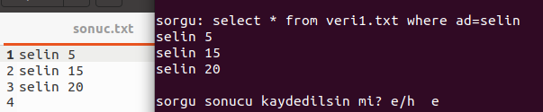

# database-yonetimi

Bu projenin amacı işletim sistemlerinde processler arası iletişimi anlamaktır.  

Sistemde üç adet program bulunmaktadır. Bunlardan “program.c” ana programdır ve bir terminalden sonsuz döngüde çalıştırılır. Bir diğer program olan “database.c” programı ise başka bir döngüde sonuz döngüde çalıştırılır. “database.c” programı “veri.txt” dosyasından veri okuyarak “program.c” programına sorgu sonucu döndüren bir servis programıdır. “program.c” içerisinde bir sorgu yazılır.  

Sorgu örnekleri:  
* select * from veri1.txt where ad=fatih
* select number from veri2.txt where ad=selin
* select ad from veri2.txt where number=2  

Yazılan sorgu named pipe ile “database.c” programına gönderilir. “database.c” programı sorguyu parçalayarak istenilen dosyadan istenilen bilgiyi bir sonuc string’e ekler ve named pipe üzerinden döndürür. Eğer bir sonuç bulamamışsa “null” değerini string olarak döndürür. Dönen sonuç “null” yazısı değilse ana “program.c” programımız “sorgu sonucu kaydedilsin mi?e/h” diye sorar ve cevap evet ise programdan fork->exec ile “kaydet.c” programı çalıştırılır ve isimsiz pipe ile kaydedilecek veri “kaydet.c” programıan gönderilir. “kaydet.c” programı gelen datayı “sonuc.txt” dosyasına kaydederek sonbulur. Ana program bu child prosesin 
(“kaydet.c”) bitmesine kadar bekler(wait) ve sonra döngüsüne devam eder.    

